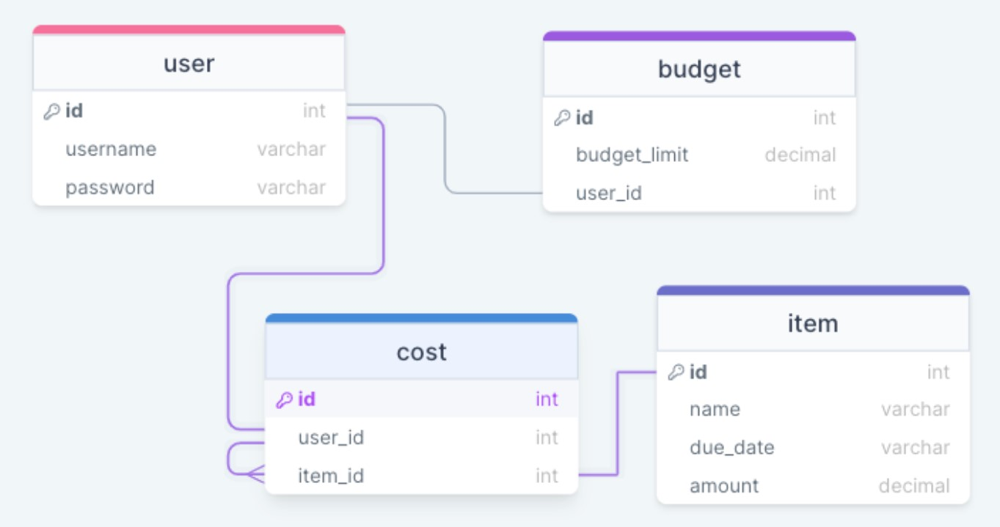
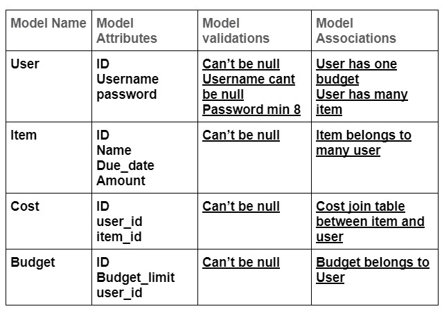
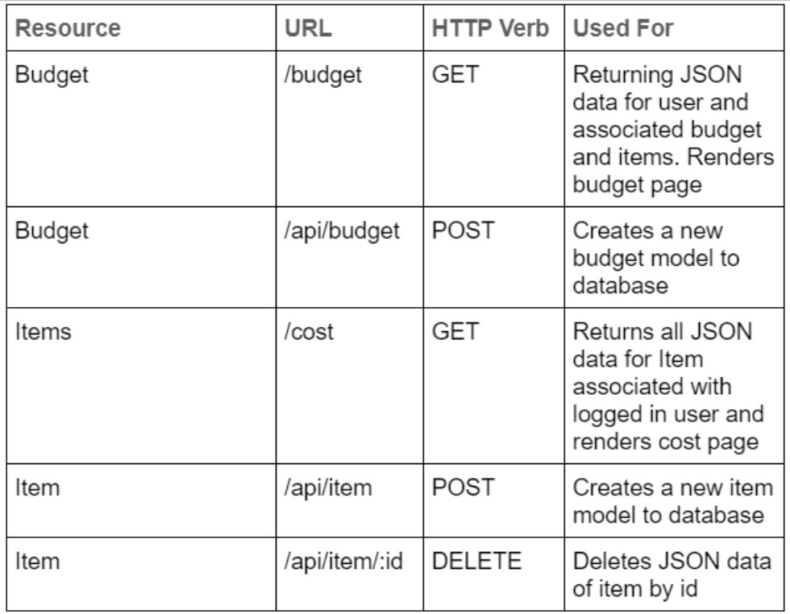
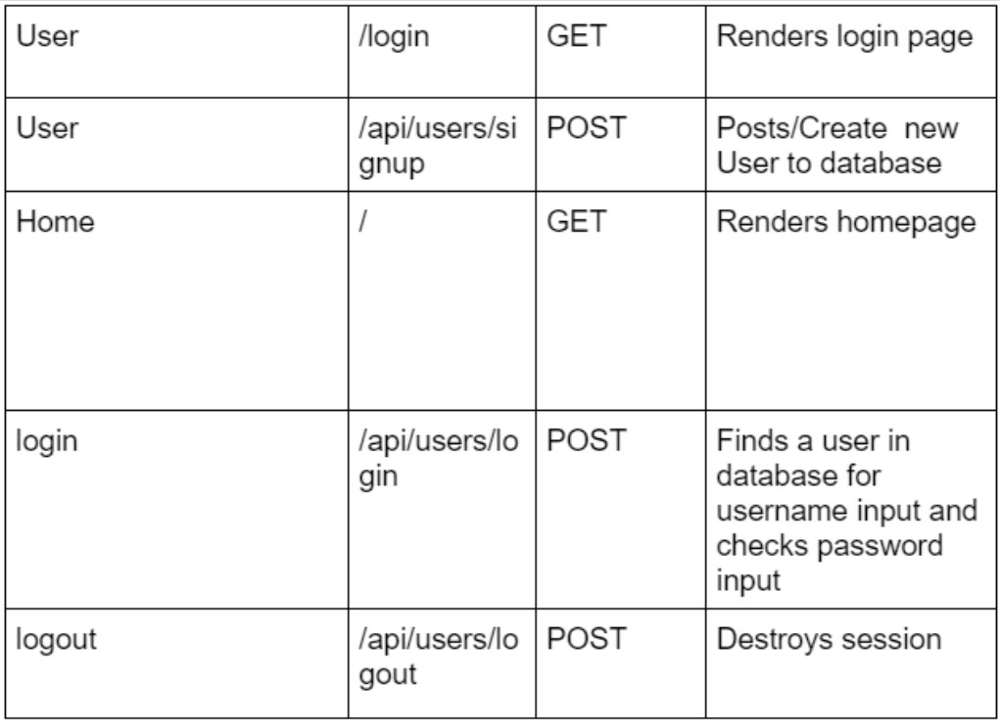
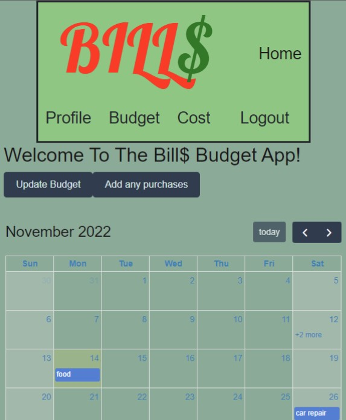
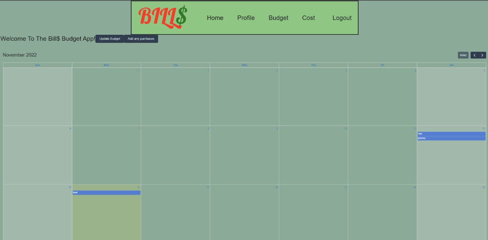

# Bills Budget App

## Table of Contents
* [Authors](#authors)
* [Description](#description)
* [License](#license)
* [Technologies](#technologies)
* [User Story](#user-story)
* [Features](#features)
* [Models](#models)
* [Routes](#routes)
* [Links](#links)
* [Screenshots](#screenshots)

## Authors

1) Nichole Guan [LinkedIn](https://www.linkedin.com/in/nichole-guan-18aa7913a/)/[GitHub](https://github.com/ncguan)
2) Mehmet Musabeyoğlu [LinkedIn](https://www.linkedin.com/in/mehmet-musabeyoglu)/[GitHub](https://github.com/MehmetMusabeyoglu)
3) Allen Klein [LinkedIn](https://www.linkedin.com/in/allen-klein-506031251/)/[GitHub](https://github.com/allen-ek)
4) Danial Mirza [LinkedIn](https://www.linkedin.com/in/danial-mirza-2860a0206/)/[GitHub](https://github.com/danialmirza99)

## Description

Bills… One of the biggest challenges of adulting! Every month we deal with an endless stream of bills and payments each due for various dates within the month. If we don’t keep track of these consistently, we risk running out of our budget before the next paycheck comes or we might forget to pay them on time resulting in overdue charges. But worry no more! Bill$ is here to make your life easier, so you can enjoy the fun parts of being an adult. With the user friendly calendar interface of Bill$, you can save your upcoming payments with due dates, see a list of all the payments you need to make through the month, see payments before their due date to avoid late fees, and overall have more visibility into your finances to keep better track of your budget.

## License

Please refer to the LICENSE in the repo.

## Technologies

### FrontEnd

- CSS
- Javascript / jQuery
- Fetch / AJAX
- Bootstrap
- Wireframe Tool (Google Slides)
- FullCalendar
- jQuery UI - Datepicker

### BackEnd

- Node
- NPM packages
- Express
- MySQL
- Sequelize ORM
- User Authentication - Bcrypt
- Handlebars
- Insomnia

## User Story

| As a         | I want to                            | So that   
| ------------ | ------------------------------------ | ------------    |
| `User` | see a cal, two buttons - add items,update budget - if logged in | ` I can see home page and be able to redirect to another page to add or update` |
| `User` | see an empty cal, home button and login button that redirects to login page if not logged in | `I can see the log in or sign up forms` |
| `User` | submit the signup form | `I can create an account` |
| `User` | submit the login form | `I can log in` |
| `User` |  track payments over a period of time | `I don't go over budget and have no monies` |
| `User` | see what upcoming payments must be made | `I can plan and budget accordingly to the amount` |   
| `User` |  see the date of when payments are due for each item | `I can pay on time avoiding late fees` |
| `User` | have my budget for the month | `I can add purchases accordingly to my budget` |   
| `User` |  add a new item that I have paid or have to pay | ` I can track all my payments` |
| `User` | see previous payments | ` I can see the amount spent for that year or month` |

## Features

1) Allow users to login and logout of the application
2) Allow users to set a monthly budget
3) Allow users to add previous, current, and future payments
4) Dsiplay payments on a Calendar
5) Include multiple pages, including: home, profile, budget, cost, and login/signup
6) Allow users to view payments from previous months/years
7) View total remaining budget after including spendings
8) Highlight current date on the calendar
9) Allow navigation to previous and upcoming months

## Models

  

## Routes

  

  

## Links

[Heroku Deployed Application Link](https://bills-manager2022.herokuapp.com/)

[Github Repository Link](https://github.com/danialmirza99/bills-budget-app/)

[Full Calendar Link](https://fullcalendar.io/)

## Screenshots

### Login/Signup Page

### Calendar Render

### Bootstrap

### Adding Purchases

### Client Side Code

### Backend Server Side Route

### Homepage

### Cost Page

### Budget Page

### Profile Page

### Login/Signup Page

### Mobile Size

### Full Size

