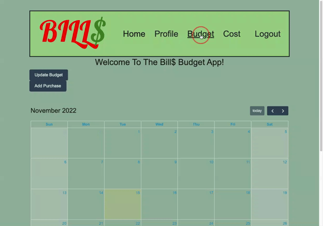
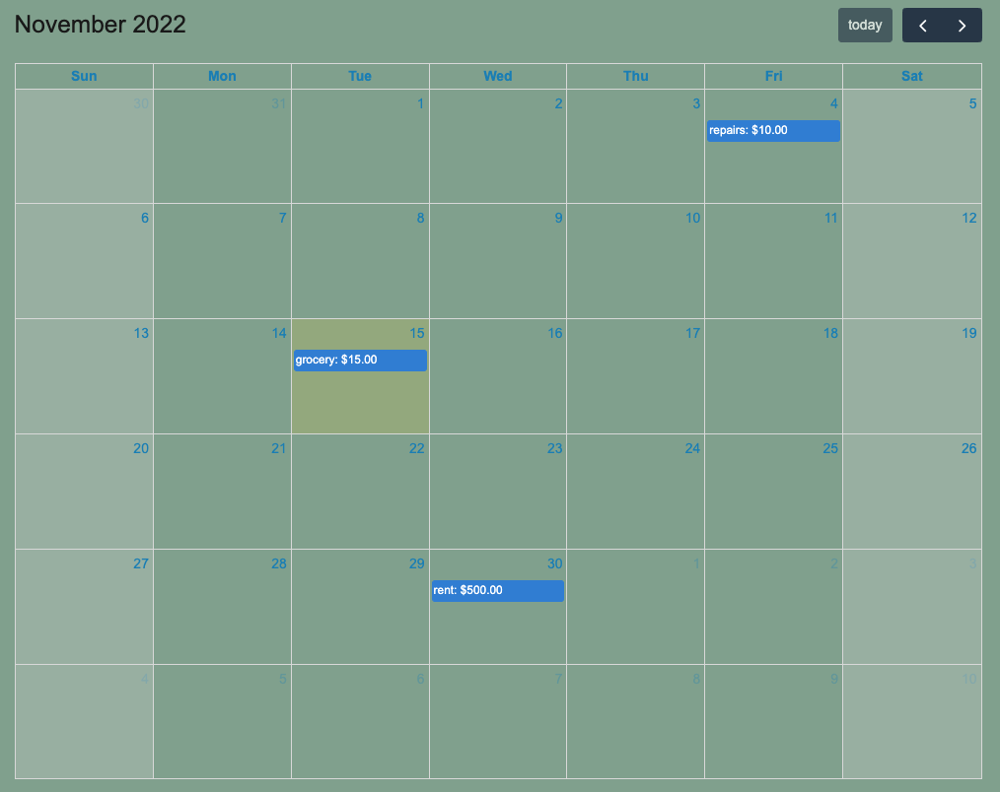
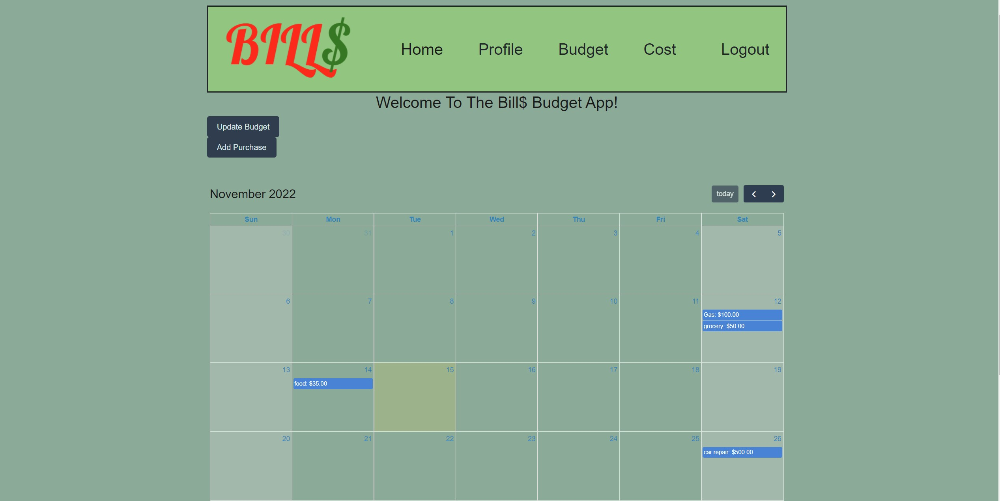

# Bills Budget App

## Table of Contents
* [Authors](#authors)
* [Description](#description)
* [Links](#links)
* [License](#license)
* [Technologies](#technologies)
* [User Story](#user-story)
* [Features](#features)
* [Code Snippets](#code-snippets)
* [Models](#models)
* [Routes](#routes)
* [Screenshots](#screenshots)

## Authors

1) Nichole Guan [LinkedIn](https://www.linkedin.com/in/nichole-guan-18aa7913a/)/[GitHub](https://github.com/ncguan)
2) Mehmet Musabeyoğlu [LinkedIn](https://www.linkedin.com/in/mehmet-musabeyoglu)/[GitHub](https://github.com/MehmetMusabeyoglu)
3) Allen Klein [LinkedIn](https://www.linkedin.com/in/allen-klein-506031251/)/[GitHub](https://github.com/allen-ek)
4) Danial Mirza [LinkedIn](https://www.linkedin.com/in/danial-mirza-2860a0206/)/[GitHub](https://github.com/danialmirza99)

## Description

Bills… One of the biggest challenges of adulting! Every month we deal with an endless stream of bills and payments each due for various dates within the month. If we don’t keep track of these consistently, we risk running out of our budget before the next paycheck comes or we might forget to pay them on time resulting in overdue charges. But worry no more! Bill$ is here to make your life easier, so you can enjoy the fun parts of being an adult. With the user friendly calendar interface of Bill$, you can save your upcoming payments with due dates, see a list of all the payments you need to make through the month, see payments before their due date to avoid late fees, and overall have more visibility into your finances to keep better track of your budget.

### Test Account

Test out our site on https://bills-manager2022.herokuapp.com/ by logging in with the
username as "user" and password as "password".

Username: user
Password: password

## Links

[Heroku Deployed Application Link](https://bills-manager2022.herokuapp.com/)

[Github Repository Link](https://github.com/danialmirza99/bills-budget-app/)

[Full Calendar Documentation Link](https://fullcalendar.io/)

[Bootstrap Documentation Link](https://getbootstrap.com/docs/5.2/getting-started/introduction/)

## License


[](https://opensource.org/licenses/MIT)


## Technologies

### FrontEnd

- CSS
- Javascript / jQuery
- Fetch / AJAX
- Bootstrap
- Wireframe Tool (Google Slides)
- FullCalendar
- jQuery UI - Datepicker

### BackEnd

- Node
- NPM packages
- Express
- MySQL
- Sequelize ORM
- User Authentication - Bcrypt
- Handlebars
- Insomnia

## User Story

| As a         | I want to                            | So that   
| ------------ | ------------------------------------ | ------------    |
| `User` | see a cal, two buttons - add items,update budget - if logged in | ` I can see home page and be able to redirect to another page to add or update` |
| `User` | see an empty cal, home button and login button that redirects to login page if not logged in | `I can see the log in or sign up forms` |
| `User` | submit the signup form | `I can create an account` |
| `User` | submit the login form | `I can log in` |
| `User` |  track payments over a period of time | `I don't go over budget and have no monies` |
| `User` | see what upcoming payments must be made | `I can plan and budget accordingly to the amount` |   
| `User` |  see the date of when payments are due for each item | `I can pay on time avoiding late fees` |
| `User` | have my budget for the month | `I can add purchases accordingly to my budget` |   
| `User` |  add a new item that I have paid or have to pay | ` I can track all my payments` |
| `User` | see previous payments | ` I can see the amount spent for that year or month` |

## Features

1) Allows new visitors to sign up

2) Allow users to login and logout of the application

3) Allow new users to add a monthly budget

4) Allow users to update a monthly budget

5) Allow users to add previous, current, and future payments

6) Display payments on a Calendar

7) Multiple pages, including: home, profile, budget, cost, and login/signup
8) Allow users to view payments from months/years different from the current

9) View total remaining budget after including spendings

10) Allow navigation to previous and upcoming months


## Code Snippets

### Signup:
#### The code snippet below allows for the user to signup and if doesn't match password requirement or username is taken alerts the user.
```
const signupFormHandler = async (event) => {
    event.preventDefault();

    const username = document.querySelector('#username-signup').value.trim();
    const password = document.querySelector('#password-signup').value.trim();

    if (username && password) {
        const response = await fetch('/api/users/signup', {
            method: 'POST',
            body: JSON.stringify({ username, password }),
            headers: { 'Content-Type': 'application/json' },
        });

        if (response.ok) {
            document.location.replace('/');
        } 
        else if(response.username==null){
            console.log(response)
            alert("Username is taken or Password must be 8 characters containing letters or numbers");
            console.log(response.message);
        }
        
    }
};
```

### Calendar Render:
#### The code snippet below is the code to create a calendar object with Toast calander UI.
```
   var calendar = new FullCalendar.Calendar(calendarEl, {
      initialDate: date,
      selectable: true,
      businessHours: true,
      dayMaxEvents: true,
      events: authInfo
    });
```

### Client Side Adding Purchases:
#### The code snippet below allows for the clientside to add a purchase through thier bowser to the server.
```
const addCostHandler = async (event) => {
    event.preventDefault();

    const newBill = document.querySelector('#bill-name').value.trim();
    const newAmount = document.querySelector('#bill-amount').value.trim();
    const newDueDate = document.querySelector('#bill-due-date').value.trim();

    if (newBill && newAmount && newDueDate) {
        const response = await fetch('/api/cost', {
            method: 'POST',
            body: JSON.stringify({ newBill, newAmount, newDueDate }),
            headers: { 'Content-Type': 'application/json' },
        });

        if (response.ok) {
            console.log(newBill)
            console.log(newAmount)
            console.log(newDueDate)
            document.location.replace('/cost');
            
        } else {
            alert(response.statusText);
        }
    }
};
```

### Backend Server Side Adding Purchases:
#### The code snippet below sends a post request to add an item to the mysql database.
```
router.post('/', withAuth, async (req, res) => {
    try {
        const newItem = await Item.create({
            name: req.body.newBill,
            amount: req.body.newAmount,
            due_date: req.body.newDueDate,
            user_id: req.session.user_id,
        });
        res.status(200).json(newItem);
    } catch (err) {
        res.status(500).json(err);
    }
});
```

### Client Side Budget Page:
#### The code snippet below allows for the clientside to view thier budget on the budget page.
```
const updateBudgetHandler = async (event) => {
    event.preventDefault();

    const budget_limit = document.querySelector('#updateBudget').value.trim();

    if (budget_limit) {
        const response = await fetch('/api/budget', {
            method: 'PUT',
            body: JSON.stringify({ budget_limit }),
            headers: { 'Content-Type': 'application/json' },
        });

        if (response.ok) {
            document.location.replace('/budget');
        } else {
            alert(response.statusText);
        }
    }
};
```

### Backend Server Side Budget Page:
#### The code snippet below is the code to update the Budget model within MYSQL using sequelize.
```
router.put('/', withAuth, async (req, res) => {
    try {
        const updateBudget = await Budget.update(req.body, {
            where: {
                user_id: req.session.user_id,
            },
        });
        res.status(200).json(updateBudget);
    } catch (err) {
        res.status(500).json(err);
    }
});
```

## Models

<p align="center">
  
</p>

<p align="center">
  
</p>

## Routes

<p align="center">
  
</p>

<p align="center">
  
</p>

## Screenshots

### Bootstrap

<p align="center">

</p>

### Mobile Size

<p align="center">

</p>

### Middle Size

<p align="center">

</p>

### Full Size

<p align="center">

</p>